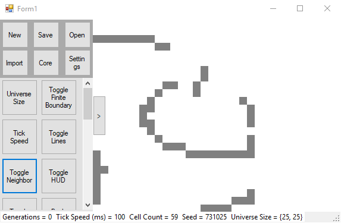

# Advanced Game of Life

This is a Conway's Game of Life clone built in C# using Windows Forms.
It has advanced the design by implementing a hexagonal grid.

The user can enable or disable cells by painting with their cursor. Such streaks will always be contiguous.

The grid can be generated randomly, or from a seed.

Life Lexicon's PlainText format is supported for editing in this application.

The interface slides horizontally and scales to arbitrary window dimensions.

## License

This project is licensed under the GPL 3.0 License - see the [LICENSE.md](LICENSE.md) file for details
